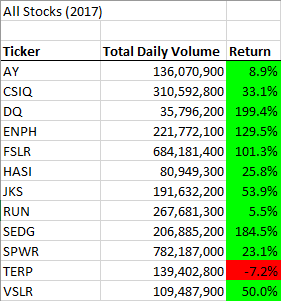
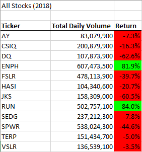
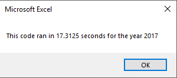
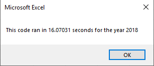
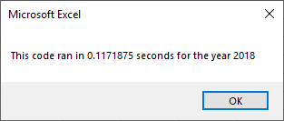

# stocks-analysis

## Overview of Project

### Background and Purpose
* The analysis project is performed to assist Steve on choosing a Green Stock for his parents. His parents are planning to invest into a Green Stock as a part of their portfolio, and would like to perform analyzation on thousands of stocks from last year. The initial code worked well for a dozen of stocks, but fails to satisfactorily perform the necessary calculation with a larger data set. The code would need to be refactored in order to run smoothier to accommodate a larger data set. 

* The purpose of the project is to refactor the existing code, and determine if the stock DAQO is a good investment. We would then look at the total daily volume and returns for DAQO in comparison with the rest of stocks to determine if a investment into DAQO is well justified. 

## Results

### DAQO Stock Performance for 2017 and 2018

The following are the results for the stocks' analyzations for 2017 and 2018.

* For the previous results, DAQO stock was out-performing all other green stocks in the list. However, 2018 depicted the most loss. Clearly, DAQO is a highly volatile stock to invest into, which can yield in high returns with high risk.
* DQ also suffers from the lowest Total Daily Volume out of all the other Green Stocks in the list. For Steve's situation, who is choosing to invest for his parents, a stock like DQ is not recommended for someone who is in need to grow their portfolio with lower risks. Thus, it is highly recommended that Steve's parents pay more attention with stocks with higher trading volumes and less volatility. From the 2017 and 2018 lists, the stock ENPH has shown satisfactory results in both the Yearly Return, and the Total Trading Volume. For both years, ENPH has out performed all other Green Stocks with the highest Trading Volume. This clearly shows that ENPH has a solid positive net growth for both years without much of a financial bubble that was likely created by DQ during 2017. 

## Summary 

### 2017
* The following are the execution times of the original script before the refactoration for 2017. 

### 2018
* The following are the execution times of the original script before the refactoration for 2018. 

* From the previous shown time, refactorization has drastically decreased the calculation time needed to perform the necessary results. Though both codes do result in a same answer, the refactored code used less than 1% of the time to compute compared to the original code. The drastic drop in computing time was a result of creating a for-loop through the data. 

### Advantages of refactoring Code
* One noticeable advantage is that it makes the code run more efficiently by taking fewer necessary steps. 
* It is easier to understand for future modifications. 
* Less computing memory is needed for the refactoring code. 

### Disadvantages of refactoring Code
* Refactor would involve more logic to make the for-loop run efficiently, therefore programming time would take longer. 
* Spacing and organization is crucial in organizing the code. 

### Pros and Cons applying to refactoring the original VBA script
* A noticeable pro
