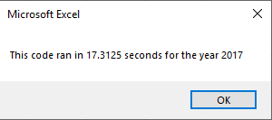
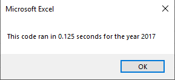

# stocks-analysis

## Overview of Project

### Background and Purpose
* The analysis project is performed to assist Steve on choosing a Green Stock for his parents. His parents are planning to invest into a Green Stock as a part of their portfolio, and would like to perform analyzation on thousands of stocks from last year. The initial code worked well for a dozen of stocks, but fails to satisfactorily perform the necessary calculation with a larger data set. The code would need to be refactored in order to run smoothier to accommodate a larger data set. 

* The purpose of the project is to refactor the existing code, and determine if the stock DAQO is a good investment. We would then look at the total daily volume and returns for DAQO in comparison with the rest of stocks to determine if a investment into DAQO is well justified. 

## Results
* The following are the execution times of the original script before the refactoration for 2017. 

* The following is execution time after the refactoration for 2017.

